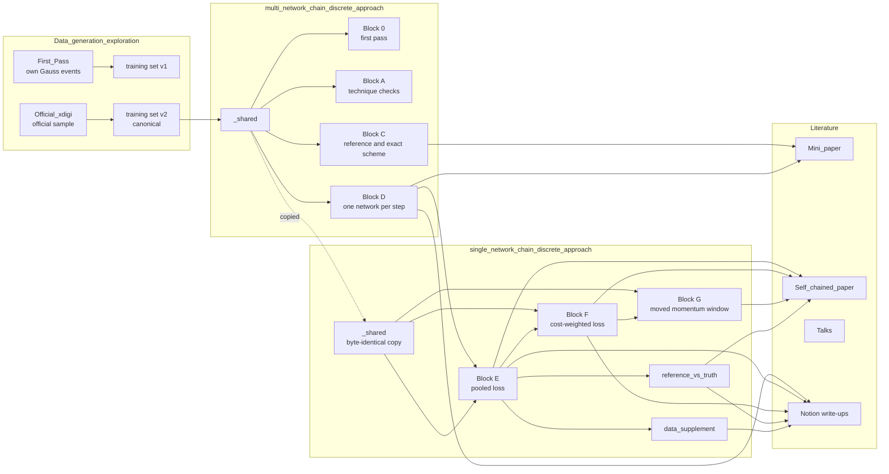
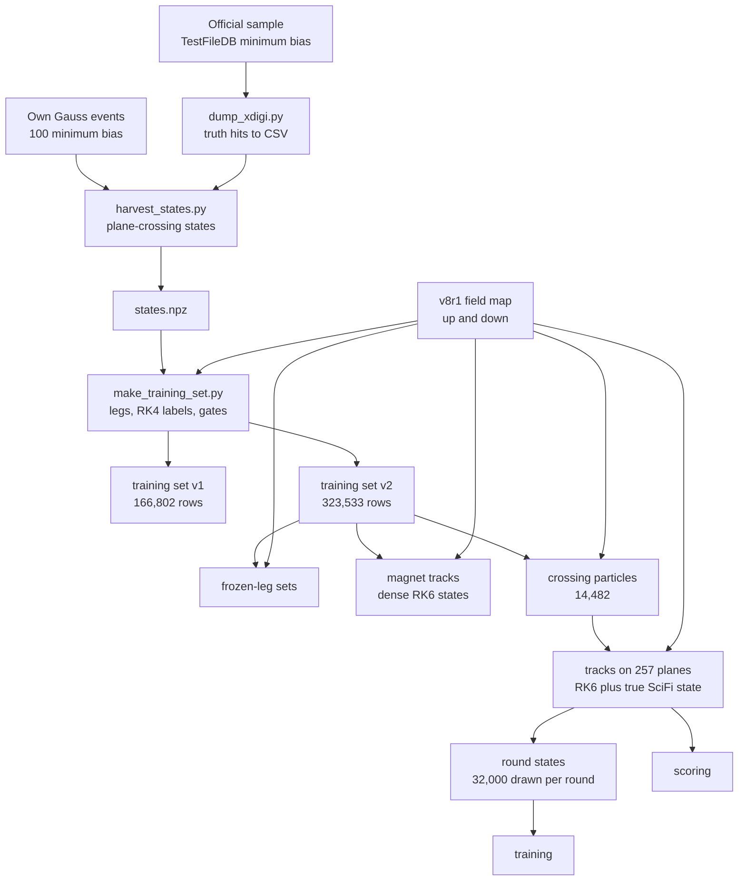
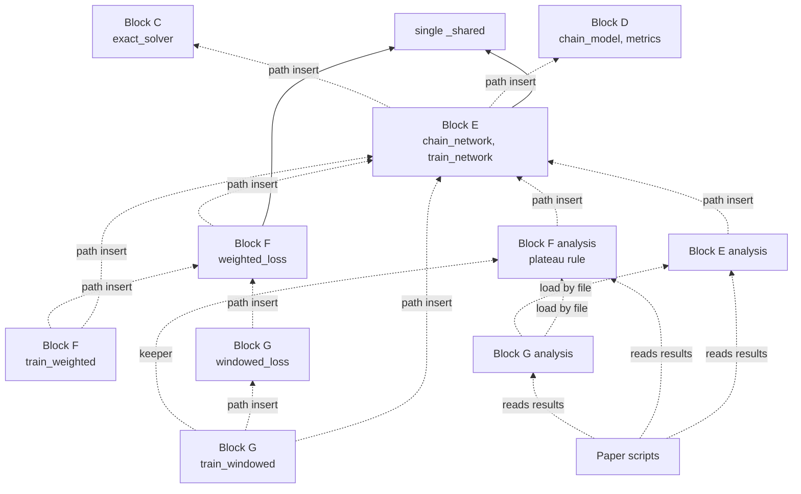

# Index of what has been built in the LHCb extrapolation project

**Date:** 2026-09-28 · **Scope:** `LHCb_Extrapolation_Project/` · **Nothing here was moved or changed.**

This is the library of what exists: numerical methods, networks, loss functions, data used as
targets, trainers, metrics, gates, trained runs and literature. Part B records what slows
iteration in the present layout, with the evidence.

The plan for the package is in [PACKAGE_PLAN.md](PACKAGE_PLAN.md). The package covers only the
self-chained network that emits the Gauss–Legendre stages. Everything else indexed here stays
frozen in place as the record.

All links are relative to this file. Block letters appear only as folder names.

| Marked in this index | Meaning |
|---|---|
| **carried into the package** | ported, gated bit for bit against the code here |
| **frozen** | kept as the record, not ported |

| Collection | Carried into the package | Frozen |
|---|---|---|
| Numerical methods | equation of motion, both field maps, Gauss–Legendre tableau, exact collocation, RK6 | RK4, the standalone port |
| Networks | none as they stand; the package network is new | all four, because each learns a correction to the straight line or is one of many per step |
| Loss functions | the reconstruction residual, the pooled weight, the cost-weighted weight | the ablation modes, both supervised losses as written |
| Data | tracks on 257 planes, training set v2 as its source | training set v1, frozen-leg sets, magnet tracks, crossing particles |
| Trainers | the round protocol | the shared driver, the chain of separate networks |
| Metrics | scoring, error along the track, convergence, reference against truth | the per-study figure scripts |

---

## A. Index of what exists

### A.0 The project at a glance

| Folder | Role | Size on disk |
|---|---|---|
| [Data_generation_exploration/](../Data_generation_exploration/) | simulation, reconstruction, truth dumps, the two training sets | 1.2 GB |
| [multi_network_chain_discrete_approach/](../multi_network_chain_discrete_approach/) | July to mid-September studies: first pass, technique checks, step and stage table, one network per step | 2.3 GB |
| [single_network_chain_discrete_approach/](../single_network_chain_discrete_approach/) | from 16 September: one network applied to itself, three losses, reference against truth | 657 MB |
| [Self_chained_paper/](../Self_chained_paper/) | second mini-paper, with its own numbers and figure scripts | 71 MB |
| [Mini_paper/](../Mini_paper/) | first mini-paper | |
| [Talks/](../Talks/) | progress talk of 7 September | |
| [self_chained_network_cost_function_investigation/](../self_chained_network_cost_function_investigation/) | empty | |
| [RK_Pinn_module/](./) | this plan | |

Environment: Python 3.10.19, torch 2.9.1, numpy 2.2.6, scipy 1.15.3, in the conda environment `TE`. All training is double precision, single-threaded, on the HTCondor farm.

Repository state: HEAD is `aac1692f`. There are uncommitted modifications in more than twenty tracked files across Blocks D, E and F.

### A.1 Numerical methods

| Method | What it is | Where | Verified by |
|---|---|---|---|
| Equation of motion | `deriv(S, z, field)` for S = (x, y, tx, ty, q/p), q/p conserved, Allen units | [reference.py](../single_network_chain_discrete_approach/_shared/reference.py) | label gates G1 to G4 in [gates.json](../Data_generation_exploration/Data/results/gates.json) |
| Differentiable rates | `LHCbRates`, the same equation in torch, evaluated at the network's proposed stage positions | [model.py](../single_network_chain_discrete_approach/_shared/model.py) | [check_loss_uses_the_field.py](../multi_network_chain_discrete_approach/Block_A_technique_works/A4_Magnet_up_field/check_loss_uses_the_field.py) |
| Field map, numpy | `FieldV8R1`, trilinear on the v8r1 grid, both polarities | [field_v8r1.py](../single_network_chain_discrete_approach/_shared/field_v8r1.py) | [vendoring_parity.py](../multi_network_chain_discrete_approach/_shared/vendoring_parity.py), [check_field.py](../multi_network_chain_discrete_approach/Block_A_technique_works/A4_Magnet_up_field/check_field.py) |
| Field map, torch | `FieldTorch`, the double-precision differentiable twin | [field_torch.py](../single_network_chain_discrete_approach/_shared/field_torch.py) | `parity` in the same file |
| Gauss–Legendre tableau | `gauss_legendre(q)`, built from Legendre roots and barycentric collocation integrals, any q | [irk.py](../single_network_chain_discrete_approach/_shared/irk.py) | `verify_tableau`: five identities, literature tableaux for q = 1, 2, 3 |
| Exact collocation step | the implicit stage equations solved with a root finder, no network | [exact_solver.py](../multi_network_chain_discrete_approach/Block_C_step_size_and_stages/C2_Exact_scheme_table/exact_solver.py), `exact_step` in irk.py | residual tolerance 1e-9 |
| Exact scheme, chained | the exact step applied N times across the magnet | [D2 exact_chain.py](../multi_network_chain_discrete_approach/Block_D_fixed_step_crossing/D2_Comparators/exact_chain.py), [E2 exact_chain.py](../single_network_chain_discrete_approach/Block_E_single_network_chain/E2_Comparators/exact_chain.py) | all solves converged |
| Explicit RK4 | fixed step 5 mm, the label engine of the training sets | `rk4_rows` in reference.py | step convergence gate G3 |
| Explicit RK6 | Butcher's seven-stage method, fixed step 0.1 mm, the fine reference | `rk6_rows`, `rk6_dense_rows` in reference.py | [check_tableau.py](../multi_network_chain_discrete_approach/Block_C_step_size_and_stages/C1_Fine_reference/check_tableau.py), [measure_convergence.py](../multi_network_chain_discrete_approach/Block_C_step_size_and_stages/C1_Fine_reference/measure_convergence.py) |
| Straight line | the null comparator, and the base of the correction form | `straight_line_states` in [chain_model.py](../multi_network_chain_discrete_approach/Block_D_fixed_step_crossing/D1_Chain_grid/chain_model.py) | zeroed last layer reproduces it exactly |
| Standalone port | both integrators in one numpy and scipy file, outside the repository | `/data/bfys/gscriven/gl_rk6.py` | ported line for line |

Related system: the van der Pol study at `/data/bfys/gscriven/Van_Der_Pole/` holds the original tableau builder and the RK6 coefficients that were copied here.

### A.2 Networks

| Network | Inputs | Outputs | What it learns | Size used | Where |
|---|---|---|---|---|---|
| One-step network | state, optional extra inputs | q stage states and the endpoint | the states directly, as in Raissi et al. | 4 × 50 by default | `OneStepNetwork` in [model.py](../single_network_chain_discrete_approach/_shared/model.py) |
| Fixed-leg correction network | state; the leg is a buffer, not an input | q stage states and the endpoint | a correction to the straight line, one scale for x and y | 2 × 128 | `FrozenResidualNetwork` in [chain_model.py](../multi_network_chain_discrete_approach/Block_D_fixed_step_crossing/D1_Chain_grid/chain_model.py) |
| Supervised endpoint network | state at the start plane | the endpoint only | a correction to the straight line | 2 × 128, q = 0 | the same class, used by [train_twin.py](../multi_network_chain_discrete_approach/Block_D_fixed_step_crossing/D2_Comparators/train_twin.py) |
| Self-chained network | state and the start plane z | q stage states and the endpoint | a correction to the straight line, separate scale for y | 2 × 128 | `ChainNetwork` in [chain_network.py](../single_network_chain_discrete_approach/Block_E_single_network_chain/E1_Network_grid/chain_network.py) |

Every network is a tanh multilayer perceptron. They differ in three independent choices, which the package should separate:

- **The body:** width, depth, which inputs.
- **The output form:** states directly, or straight line plus a scaled correction. The planned form where the endpoint is the weighted sum of the stages is a third option.
- **The scale:** fixed constants, or per track from the field integral along the straight line.

Application: `carry` in chain_network.py applies one network N times. [apply_chain.py](../multi_network_chain_discrete_approach/Block_D_fixed_step_crossing/D1_Chain_grid/apply_chain.py) applies N different networks in sequence.

### A.3 Loss functions

All label-free losses share one core, `reconstruction_residuals` in [model.py](../single_network_chain_discrete_approach/_shared/model.py). Each output must reconstruct the input through the implicit Runge–Kutta equations. The losses differ only in the weight applied to that residual.

| Loss | Weight on the residual | Labels | Where |
|---|---|---|---|
| Pooled | one constant per component, the spread over the training states | none | `physics_loss` in model.py |
| Cost-weighted | lever arm to the last plane, divided by the track's total bend, times a momentum window, clamped | none | `weighted_loss` in [weighted_loss.py](../single_network_chain_discrete_approach/Block_F_reweighted_loss/F0_Weighting/weighted_loss.py) |
| Cost-weighted ablations | the same with one factor replaced by its average: `no_lever`, `no_track`, `no_window` | none | `MODES` in weighted_loss.py |
| Cost-weighted, window from the run | the same, with the window read from the run's constants | none | [windowed_loss.py](../single_network_chain_discrete_approach/Block_G_low_momentum_window/G0_Weighting/windowed_loss.py) |
| Supervised, stages and endpoint | mean squared error against reference stage and endpoint states | RK4 or RK6 | `data_loss` in model.py |
| Supervised, scaled by the correction | mean squared error divided by the per-track correction scale | RK6 endpoint | `residual_data_loss` in chain_model.py |

Every weighted loss has three standing gates: torch equals an independent numpy implementation, the unweighted mode reproduces the pooled loss to the last bit, and the exact collocation solution gives machine zero under every mode.

### A.4 Data used as targets

| Dataset | Content | Rows | Built by | File |
|---|---|---|---|---|
| Training set v1 | states from 100 self-generated minimum-bias events, RK4 labels, four leg types | 166,802 | [make_training_set.py](../Data_generation_exploration/Data/make_training_set.py) | `Data/training_v1/train_mb100_v1.npz` |
| Training set v2, canonical | the same construction on the official sample | 323,533 (train 258,857, validation 32,389, test 32,287) | the same script, fed by [dump_xdigi.py](../Data_generation_exploration/Official_xdigi/dump_xdigi.py) | `Official_xdigi/training_v2/train_official_v2.npz` |
| Frozen-leg sets | one fixed magnet crossing, per stage count and polarity | per file | `frozen_leg_dataset` in [prepare.py](../single_network_chain_discrete_approach/_shared/prepare.py) | `Block_0_first_pass/*/results/`, `Block_A_technique_works/*/results/` |
| Magnet tracks | stratified legs over step length, with dense RK6 states | per file | `magnet_tracks_dataset` in prepare.py | `C0_Magnet_tracks_dataset/results/magnet_tracks_v3.npz`, `dense_states.npz` (464 MB) |
| Crossing particles | forward particles across the magnet on the planes of each step count | 14,482 particles | [build_dataset.py](../multi_network_chain_discrete_approach/Block_D_fixed_step_crossing/D0_Crossing_dataset/build_dataset.py) | `D0_Crossing_dataset/results/crossing_particles.npz` |
| Tracks on 257 planes | the same particles, RK6 states on 257 planes, plus the true state at the particle's own first SciFi plane | 14,482 (train 11,567, validation 1,463, test 1,452) | [build_tracks.py](../single_network_chain_discrete_approach/Block_E_single_network_chain/E0_Track_dataset/build_tracks.py) | `E0_Track_dataset/results/tracks.npz` (116 MB) |

Three kinds of target exist, and they answer different questions:

| Target | Contains | Used for |
|---|---|---|
| Geant4-true state | field, scattering, energy loss, interactions | the floor no field-only method can beat |
| RK6 reference state | the field only, integrated to 28 pm step convergence | scoring, and supervised labels |
| Exact collocation state | what a network with zero loss would output | the ceiling of each step count and stage count |

### A.5 Trainers

| Trainer | Optimiser and stopping | Loss selection | Where |
|---|---|---|---|
| Shared driver | L-BFGS restarts, stall and confirm | `--mode physics` or `data` | [train.py](../single_network_chain_discrete_approach/_shared/train.py) |
| Chain of separate networks | the shared driver per leg, sequential | pooled | [train_chain.py](../multi_network_chain_discrete_approach/Block_D_fixed_step_crossing/D1_Chain_grid/train_chain.py) |
| Round trainer | L-BFGS restarts in rounds, later rounds train on the network's own predictions, loss rescaled on every tenfold fall | pooled, hard-wired | [train_network.py](../single_network_chain_discrete_approach/Block_E_single_network_chain/E1_Network_grid/train_network.py) |
| Round trainer, weighted | the same | cost-weighted, `--weighting` | [train_weighted.py](../single_network_chain_discrete_approach/Block_F_reweighted_loss/F1_Training/train_weighted.py) |
| Round trainer, windowed | the same | cost-weighted, `--p-lo`, `--p-hi` | [train_windowed.py](../single_network_chain_discrete_approach/Block_G_low_momentum_window/G1_Training/train_windowed.py) |

The stopping rule that is actually used is not in any trainer. It is the validation plateau rule, `plateaued_now` in [compare_to_blockE.py](../single_network_chain_discrete_approach/Block_F_reweighted_loss/F2_Analysis/compare_to_blockE.py), applied by the farm keeper through `prune_active.py`.

Farm harness: `make_jobs.py`, `resubmit.py`, `keeper.sh`, `wrapper.sh` and a submit file exist separately in Blocks D, E, F and G.

### A.6 Metrics and analysis

| Component | What it does | Where |
|---|---|---|
| Scoring | per component, per momentum band, per plane, against RK6 and against the true state | `chain_scores` in [metrics.py](../single_network_chain_discrete_approach/Block_E_single_network_chain/E1_Network_grid/metrics.py) |
| Shared scorer | prediction and chaining for the one-step network | [evaluate.py](../single_network_chain_discrete_approach/_shared/evaluate.py) |
| Error anatomy | where along the crossing the endpoint error arises | [error_anatomy.py](../single_network_chain_discrete_approach/Block_E_single_network_chain/E3_Analysis/error_anatomy.py), [anatomy_xy.py](../single_network_chain_discrete_approach/Block_F_reweighted_loss/F2_Analysis/anatomy_xy.py) |
| Convergence | the plateau rule on validation error | [convergence.py](../single_network_chain_discrete_approach/Block_G_low_momentum_window/G2_Analysis/convergence.py) |
| Reference against truth | the gap split by charge, band and particle type, compared with Highland | [decompose.py](../single_network_chain_discrete_approach/reference_vs_truth/decompose.py) |
| Paper conventions | units, bands, de-duplication, statistics | [common.py](../Self_chained_paper/scripts/common.py) |

### A.7 Gates

There are fourteen gate scripts and one pytest file. Each gate is run by hand and writes a JSON file.

| Gate | Guards |
|---|---|
| [smoke_tests.py](../multi_network_chain_discrete_approach/_shared/smoke_tests.py) | dataset parity, bitwise model parity, first-restart parity, field parity, a chain |
| [vendoring_parity.py](../multi_network_chain_discrete_approach/_shared/vendoring_parity.py) | the field loader against its archive original |
| [parity_with_block_d_shared.py](../single_network_chain_discrete_approach/_shared/parity_with_block_d_shared.py) | the two copies of `_shared` are identical |
| [check_tableau.py](../multi_network_chain_discrete_approach/Block_C_step_size_and_stages/C1_Fine_reference/check_tableau.py) | the RK6 tableau and its order |
| [check_polarity.py](../multi_network_chain_discrete_approach/Block_C_step_size_and_stages/C0_Magnet_tracks_dataset/check_polarity.py), [check_path_consistency.py](../multi_network_chain_discrete_approach/Block_C_step_size_and_stages/C0_Magnet_tracks_dataset/check_path_consistency.py) | the sample's polarity, and dense against direct integration |
| [check_against_block_d.py](../single_network_chain_discrete_approach/Block_E_single_network_chain/E0_Track_dataset/check_against_block_d.py) | the same particles in the same order across datasets |
| [check_network.py](../single_network_chain_discrete_approach/Block_E_single_network_chain/E1_Network_grid/check_network.py) | the network, its scales, and the loss at the exact solution |
| [check_weights.py](../single_network_chain_discrete_approach/Block_F_reweighted_loss/F0_Weighting/check_weights.py), [check_windowed_weights.py](../single_network_chain_discrete_approach/Block_G_low_momentum_window/G0_Weighting/check_windowed_weights.py) | the weighted losses |
| [test_chain_model.py](../multi_network_chain_discrete_approach/Block_D_fixed_step_crossing/D1_Chain_grid/test_chain_model.py) | the fixed-leg network |

### A.8 Trained runs

| Study | Runs on disk | Location |
|---|---|---|
| One network per step | 100 chains, 4,260 networks | `Block_D_fixed_step_crossing/D1_Chain_grid/results/` |
| Self-chained, pooled loss | 16 | `Block_E_single_network_chain/E1_Network_grid/results/` |
| Self-chained, cost-weighted | 3 | `Block_F_reweighted_loss/F1_Training/results/full/` |
| Self-chained, window 3 to 8 GeV | 3 | `Block_G_low_momentum_window/G1_Training/results/p03-08/full/` |

There are 4,498 weight files in total, all outside git, with no central list.

A self-chained run folder holds `scale.json` (the configuration), `network.pt`, `history.csv` (per restart), `rounds.csv` (per round), `progress.json`, `record.json` (final scores), `round_states.npz` and `chain_states.npz`.

### A.9 Literature

| Document | Source of its numbers | Where |
|---|---|---|
| First mini-paper | Blocks C and D | [Mini_paper/main.tex](../Mini_paper/main.tex) |
| Second mini-paper | `numbers.py` writes `paper_numbers.json`; seventeen figure scripts; `verify_tables.py` | [Self_chained_paper/](../Self_chained_paper/) |
| Progress talk | beamer deck of 7 September | [Talks/2026-09-07_progress_talk/](../Talks/2026-09-07_progress_talk/) |
| Notion pages, generated | one generator per write-up | [gen_writeup.py](../multi_network_chain_discrete_approach/Block_D_fixed_step_crossing/writeup/gen_writeup.py), `E4_Writeup/`, `F4_Writeup/`, `reference_vs_truth/page.md`, `data_supplement/page.md` |
| Notebooks | thirteen, each loads results and computes nothing | listed in each experiment README |

Nine write-ups sit under the project in Notion. Three are superseded, five are provisional, one is the presentation.

---

## B. What slows iteration today

Each point is measured, not an impression.

| # | Observation | Evidence | Cost |
|---|---|---|---|
| 1 | The shared machinery exists twice | ten modules in the two `_shared` folders have identical hashes; a parity script exists only to guard the copy | a fix has to be made twice, and the parity gate rerun |
| 2 | The path helper is copied into every experiment | 23 identical copies of `use_shared.py` | noise, and one more thing to keep identical |
| 3 | Scripts reach into each other by path | 43 files insert into `sys.path`; 31 load a module by file location | Block G imports F, which imports E, which imports D. Moving or renaming a folder breaks the chain |
| 4 | The loss is chosen by choosing a script | three round trainers of 432, 479 and 478 lines, differing by 85 and 67 changed lines | a new loss means a new copy of the trainer |
| 5 | A setting lived in two places | the momentum window was both a module default and a run constant; a run on the old path would have trained on a different window from the one it recorded | documented in the Block G weighting README |
| 6 | Two unit conventions and two band sets | slopes are scaled by 1,000 in `metrics.py` and dimensionless in the paper; bands are 1, 2, 5, 10, 25, 200 GeV in one and 3, 8, 20, 50 GeV in the other | the paper cannot import the analysis code |
| 7 | Runs are overwritten in place | extending a run replaced its weights and scores, so the analysis tables describe checkpoints that are no longer in the run folder | a table can stop matching the files it cites |
| 8 | Two farm jobs wrote to one run | one run holds 302 repeated restart numbers | every reader needs a de-duplication step |
| 9 | Datasets are rebuilt per experiment | the same frozen-leg file, identical hash, sits in three experiment folders | disk, and no single name for a dataset |
| 10 | Run records hold absolute paths | `scale.json` stores the dataset as a full path | a run cannot be moved or rebuilt elsewhere |
| 11 | Gates are manual | fourteen scripts, one pytest file | a change to shared code is only as safe as the memory of which gates to rerun |
| 12 | Names are historical | `residual_scale` and `FrozenResidualNetwork` mean the correction, not the loss residual | each file carries a paragraph explaining the name |
| 13 | The network's output form is fused with its class | the correction form is written into two network classes | trying a different output form means a new class |

