# Plan for the package: training self-chained Runge–Kutta networks for full tracks

**Date:** 2026-09-28 · **Version:** 4, after George's rulings of 2026-09-28, including those made after phase 1 (section 11) · **Status:** phases 1 and 2 of section 9 are built and gated (2026-09-28): the equation of motion, the field map, the tableau, the exact scheme, the sixth-order reference, the registry; the store, the track set `12a8d35c3165` and the exact states of its test split. Phases 3 to 7 are plan

The library of what already exists is in [INDEX.md](INDEX.md). This file is the plan for what is built next.

## Contents

- [1. Scope, as ruled](#1-scope-as-ruled)
- [2. What the package trains](#2-what-the-package-trains)
- [3. The loss functions](#3-the-loss-functions)
- [4. Package layout](#4-package-layout)
- [5. The standard evaluation](#5-the-standard-evaluation)
- [6. Experiments live outside the package](#6-experiments-live-outside-the-package)
- [7. Literature that is added to, not rebuilt](#7-literature-that-is-added-to-not-rebuilt)
- [8. Rebuilding](#8-rebuilding)
- [9. Build order](#9-build-order)
- [10. Plain English names](#10-plain-english-names)
- [11. One risk, and three assumptions](#11-one-risk-and-three-assumptions)
- [12. Built to be extended](#12-built-to-be-extended)
- [13. Description files and the workflow document](#13-description-files-and-the-workflow-document)
- [14. The Notion project page](#14-the-notion-project-page)

---

## 1. Scope, as ruled

| Ruling (George, 2026-09-28) | Consequence for the package |
|---|---|
| Only the single network chained to itself | one network class, applied N times. The one-network-per-step studies are not ported |
| No deviation from a straight line | the network emits the stage states themselves. No straight-line base, no per-track correction scale |
| The network learns the Gauss–Legendre stages, which are collected and summed | the endpoint is not a network output. It is the weighted sum of the stage rates |
| The two losses are equations 19 and 20 of the second mini-paper | the pooled loss and the cost-weighted loss, plus an unweighted baseline |
| The supervised twin is one unchained network for the whole crossing | a second, small network class: state at the last UT plane in, state at the first SciFi plane out |
| Hold the error at each stage and propagate it over the whole track | part of the standard evaluation, section 5 |
| Specific experiments stay outside the package | the package holds no study, no grid and no farm job list |
| The evaluations are a standard | the package holds one scorer and one set of conventions |
| Plain English conventions for everything | section 10 |
| Experiment details will change: a network that learns the whole chain in one output, new targets, new losses, even one network per step or the straight-line correction again | the package is built around contracts and registries, with the ruled choices as the defaults. Section 12 |
| Every directory has a file explaining everything in it, kept up to date | section 13, enforced by a test |
| A workflow document states how the package behaves | [WORKFLOW.md](WORKFLOW.md) |
| The Notion project page is a master index and workflow guide, with a table of experiments pointing to write-ups | section 14 |
| The ten decisions of version 1 are agreed | name `rkpinn`, store at `/data/bfys/gscriven/rkpinn_store`, the paper's units and bands, van der Pol as the second system, YAML configurations |

What is not built now:

- Nothing is ported for the one-network-per-step studies or for the straight-line correction. The package leaves a place for each, so either can be added later without touching the losses, the trainer or the evaluation.
- The import of old trained runs into the manifest. Every existing run learned a correction to the straight line, so none is a run of this package. They stay frozen and serve as the comparison the new networks are read against.
- The farm harness and the list of experiments. Both stay outside the package.

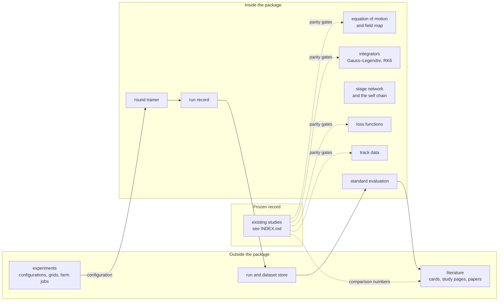

---

## 2. What the package trains

### 2.1 One step

The state is $S = (x, y, t_x, t_y, q/p)$ on a plane of constant $z$. The charge over momentum $q/p$ is conserved and passes through unchanged. The equation of motion is $dS/dz = f(S, z)$.

The network takes the state and the $z$ of the plane the step starts on, and emits the $q$ stage states of one Gauss–Legendre step of length $\Delta z$:

$$\mathcal{M}_\theta : (S_0,\ z_{\mathrm{start}}) \longmapsto (\hat S_1,\ \hat S_2,\ \dots,\ \hat S_q)$$

The stage $\hat S_k$ is the network's estimate of the track's state on the plane $z_{\mathrm{start}} + c_k\,\Delta z$, where $c_k$ are the Gauss–Legendre nodes.

The end of the step is then **collected and summed**, not predicted:

$$\hat S_{\mathrm{end}} = S_0 + \Delta z \sum_{k=1}^{q} b_k\, f\!\left(\hat S_k,\ z_{\mathrm{start}} + c_k\,\Delta z\right)$$

where $b_k$ are the Gauss–Legendre weights. The network has $4q$ outputs.

### 2.2 The chain

$\Delta z = L/N$, where $L$ is the length of the crossing. The same network is applied $N$ times. Each end state is the next input, and $z_{\mathrm{start}}$ advances by $\Delta z$.

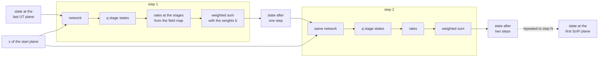

### 2.3 The whole-crossing supervised network

The twin is a separate, unchained network. It takes the state at the last UT plane and emits the state at the first SciFi plane in one application. Its target is the RK6 state at that plane. It has no stages and no physics loss.

| | Self-chained stage network | Whole-crossing supervised network |
|---|---|---|
| Input | state and start plane | state at the last UT plane |
| Output | $q$ stage states | the end state |
| Applications per track | $N$ | 1 |
| Training signal | the equation of motion, no labels | the RK6 end state |
| Knows the track between the planes | yes, at every stage of every step | no |

---

## 3. The loss functions

### 3.1 The stage residual

Every label-free loss is built on one quantity. Stage $j$ must reconstruct the input through the implicit Runge–Kutta equations:

$$r_{n,j,d} = \hat S_{n,j,d} - \Delta z \sum_{k=1}^{q} A_{jk}\, f_d\!\left(\hat S_{n,k},\ z_n + c_k\,\Delta z\right) - S_{n,d}$$

where $n$ is the training state, $j = 1 \dots q$ the stage, $d \in \{x, y, t_x, t_y\}$ the component and $A$ the Gauss–Legendre stage matrix.

**A consequence of summing the stages.** Equations 19 and 20 of the paper sum over $j = 1 \dots q+1$, where the last term is the residual of a predicted endpoint. Here the endpoint is built from the stages by the same formula the residual tests, so that term is zero identically. The package sums over the $q$ stages. This is the only change to the two equations.

### 3.2 The three label-free losses and the twin

All three are one formula with a different divisor:

$$\mathcal{L}(\theta) = \operatorname*{mean}_{n,j,d} \left(\frac{r_{n,j,d}}{s_{n,j,d}}\right)^2$$

| Loss | Divisor $s$ | Source |
|---|---|---|
| Unweighted | 1 | the baseline with no weighting at all |
| Pooled | $s_d$, one constant per component: the spread of that component over the first round's states | equation 19 |
| Cost-weighted | $D_{\mathrm{ref}} / (a_n\, g_{n,j,d})$, one value per track, per stage plane and per component | equation 20 |
| Supervised endpoint | not a residual loss: mean squared difference from the RK6 end state, per component, divided by the pooled spread | the twin |

In the cost-weighted loss, $g_{n,j,d} = (1, 1, \ell_{n,j}, \ell_{n,j})$ with $\ell_{n,j}$ the distance from the stage plane to the end of the track plus one step. $a_n$ is the square root of the momentum window times the reference bend over the track's own bend, clamped to within a factor of five of its median. The momentum window is a value in the configuration, never a default in the code.

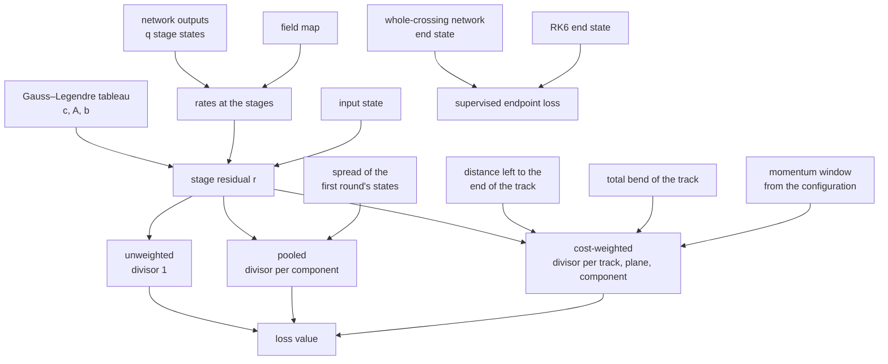

### 3.3 Gates every loss must pass

| Gate | What it proves |
|---|---|
| The exact collocation solution gives machine zero | the loss has the right minimum, whatever the weights |
| The torch weights equal an independent numpy implementation | the weight is what the formula says |
| With every weight switched off, the weighted loss equals the unweighted one to the last bit | the weighting changes nothing else |
| The constants recorded in the run equal the constants the optimiser used | no setting lives in two places |
| A loss of zero implies the summed endpoint equals the exact scheme's endpoint | the collect-and-sum step is wired correctly |

---

## 4. Package layout

Every directory holds a `README.md` that describes each file in it. Section 13 gives the rule.

```
RK_Pinn_module/
├── README.md                         what is in this directory
├── WORKFLOW.md                       how the package behaves, and how work on it proceeds
├── INDEX.md                          what exists in the project
├── PACKAGE_PLAN.md                   this file
├── pyproject.toml
├── src/rkpinn/
│   ├── README.md
│   ├── registry.py                   name in a configuration file to component
│   ├── equation_of_motion/
│   │   ├── lhcb.py                   the rates, numpy and torch
│   │   ├── field_map.py              the v8r1 map and its differentiable twin
│   │   └── van_der_pol.py            the second system
│   ├── integrators/
│   │   ├── gauss_legendre_tableau.py nodes, stage matrix, weights, and their checks
│   │   ├── exact_collocation.py      the stage equations solved with a root finder
│   │   └── runge_kutta_sixth_order.py the reference integrator
│   ├── predicted_track/
│   │   ├── track_layout.py           the planes of a track: steps, stages, nodes
│   │   └── predicted_track.py        the one structure every network fills
│   ├── networks/
│   │   ├── stage_network.py          state and start plane in, q stage states out
│   │   ├── whole_crossing_network.py the supervised twin
│   │   ├── output_forms.py           how raw outputs become states; one form now
│   │   ├── collect_and_sum.py        the end state of a step from its stages
│   │   └── self_chain.py             the network applied N times
│   ├── targets/
│   │   ├── no_target.py              label-free training
│   │   ├── reference_end_state.py    RK6 at the first SciFi plane
│   │   ├── reference_states_on_planes.py RK6 on every plane, for evaluation
│   │   ├── exact_stage_states.py     the exact scheme's stages, for evaluation
│   │   └── true_state.py             the Geant4-true state
│   ├── losses/
│   │   ├── stage_residual.py
│   │   ├── unweighted.py
│   │   ├── pooled.py
│   │   ├── cost_weighted.py
│   │   └── supervised_endpoint.py
│   ├── track_data/
│   │   ├── build_tracks.py           RK6 states on the planes, from the official sample
│   │   ├── load_tracks.py
│   │   └── draw_training_states.py   the per-round draw
│   ├── training/
│   │   ├── round_trainer.py
│   │   ├── training_protocols.py     what is drawn each round, by kind of network
│   │   ├── optimiser.py              L-BFGS restarts and loss rescaling
│   │   ├── stopping_rule.py          the validation plateau
│   │   └── checkpoints.py            snapshots, resume, one writer at a time
│   ├── evaluation/
│   │   ├── conventions.py            units and momentum bands, defined once
│   │   ├── endpoint_error.py
│   │   ├── error_along_the_track.py  stage errors held and carried to the end
│   │   ├── three_references.py       against RK6, the exact scheme, the true state
│   │   ├── convergence.py
│   │   └── standard_report.py        every table and figure of section 5
│   └── run_record/
│       ├── configuration.py          the schema and the run key
│       └── manifest.py               the list of runs and recomputed metrics
├── tests/                            the gates, as pytest
└── docs/
    ├── cards/                        one page per component
    └── notion/                       the draft of the Notion project page
```

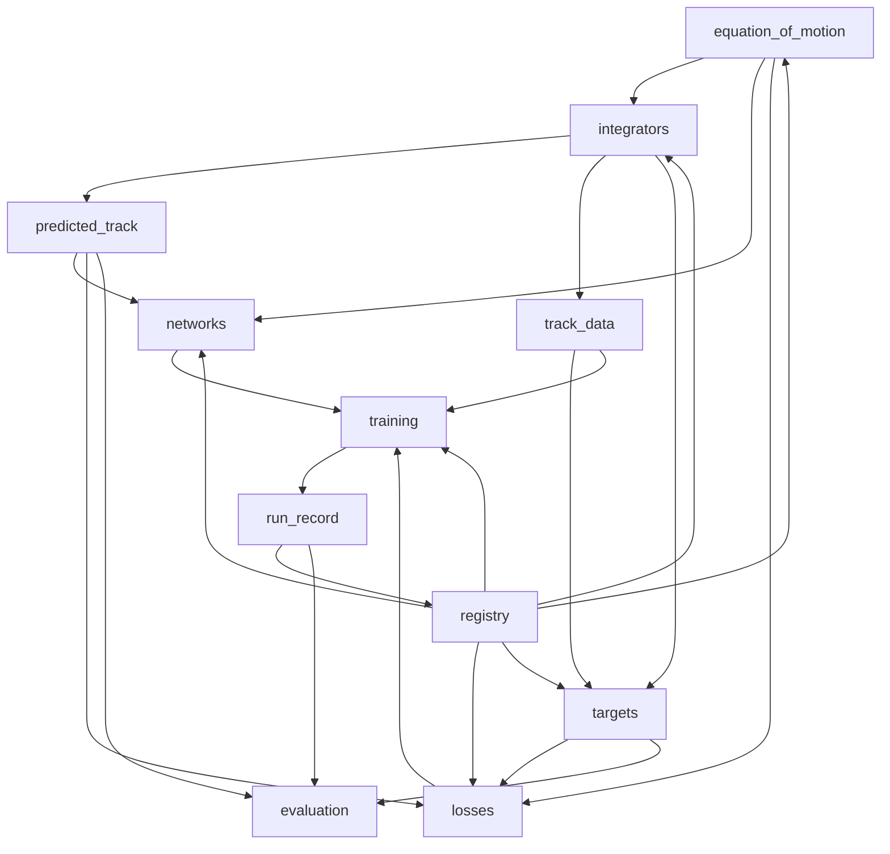

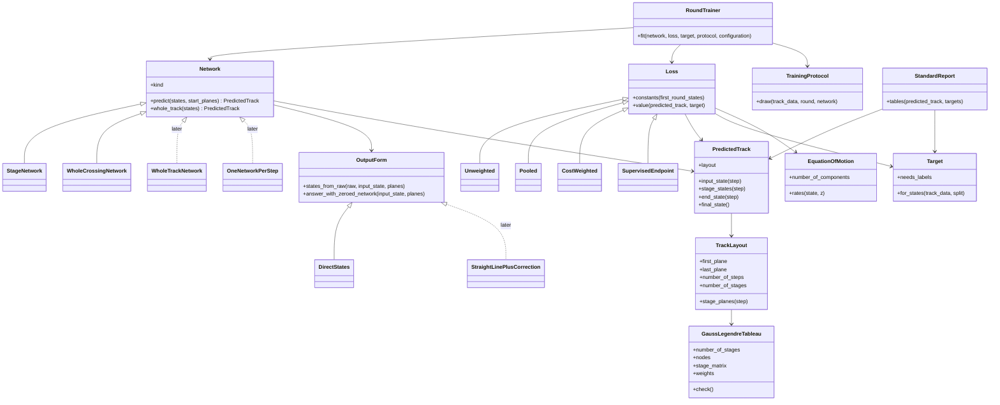

Solid arrows are built now. Dashed arrows marked *later* are places the design keeps open.

### What is ported, and from where

| Package module | Ported from | Parity gate |
|---|---|---|
| `equation_of_motion/lhcb.py` | `_shared/reference.py`, `_shared/model.py` | identical rates on 500 real states; identical gradient |
| `equation_of_motion/field_map.py` | `_shared/field_v8r1.py`, `_shared/field_torch.py` | hash of the map file; identical field values |
| `integrators/gauss_legendre_tableau.py` | `_shared/irk.py` | identical tableau to the last bit at 16 stages |
| `integrators/exact_collocation.py` | `C2_Exact_scheme_table/exact_solver.py`, `E2_Comparators/exact_chain.py` | identical to the frozen solver run on the same machine; the stored exact states reproduced to 1e-11 mm (they were written on farm nodes and differ in the last digits, measured 2026-09-28) |
| `integrators/runge_kutta_sixth_order.py` | `_shared/reference.py` | identical end state over 40 mm and 2,589 mm |
| `losses/stage_residual.py` | `_shared/model.py` | identical residual for the stage rows, given the same stage states |
| `losses/pooled.py`, `losses/cost_weighted.py` | `_shared/model.py`, `F0_Weighting/weighted_loss.py`, `G0_Weighting/windowed_loss.py` | identical weights, given the same states and constants |
| `track_data/` | `E0_Track_dataset/build_tracks.py` | the same particles, order and states as the stored file |
| `training/` | `E1_Network_grid/train_network.py` and its two copies | the same draw of training states from the same seed |
| `evaluation/` | `E1_Network_grid/metrics.py`, `E3_Analysis/`, `F2_Analysis/`, `Self_chained_paper/scripts/common.py` | the paper's numbers reproduced from the old runs' stored states |
| `predicted_track/`, `networks/`, `targets/` | **new** | their own gates, section 3.3 |

---

## 5. The standard evaluation

One command produces the same set of tables and figures for any run. A result that is not in this set is an experiment's own analysis and lives outside the package.

### 5.1 Conventions

| Quantity | Convention |
|---|---|
| Positions | micrometres |
| Slopes | dimensionless, never multiplied by 1,000 |
| Momentum bands | below 3, 3 to 8, 8 to 20, 20 to 50, above 50 GeV; the loss's own window as an extra row |
| Splits | training, validation, test, by particle |
| Statistics | median of the absolute value, 95th percentile, signed median, 68 % half-width, root mean square |
| Naming a network | by its number of steps, number of stages and step length |
| Naming an error | **endpoint** after the whole chain, or **single step** |
| Convergence | judged on the validation error, never on the loss |

### 5.2 The standard set

| # | Output | Answers |
|---|---|---|
| 1 | Endpoint error per component, all momenta | how far from the reference at the first SciFi plane, in $x$, $y$, $t_x$, $t_y$ separately |
| 2 | Endpoint error per component and per momentum band | where in momentum the error lives |
| 3 | Signed distributions per component | whether the error is a bias or a spread |
| 4 | Single-step error per component | how good one application is, before chaining |
| 5 | Error along the track | how the error grows plane by plane |
| 6 | Stage errors, held and carried | which step's stage error becomes how much endpoint error |
| 7 | Three references | the network against RK6, against the exact scheme, against the Geant4-true state |
| 8 | Convergence | validation error per round, and the round the plateau rule held |
| 9 | Where the loss puts its weight | share of the loss by momentum band and by quarter of the crossing |
| 10 | Cost | time per track, and training time |

### 5.3 Stage errors, held and carried

This is the working form of the robustness question. It will be revisited.

At every step $m$ and stage $k$ the evaluation stores the stage error against the exact scheme started from the same input:

$$\delta S^{(m)}_k = \hat S^{(m)}_k - S^{(m),\,\mathrm{exact}}_k$$

The error this causes at the end of the step follows from the collect-and-sum formula, to first order:

$$\delta S^{(m)}_{\mathrm{end}} = \Delta z \sum_{k=1}^{q} b_k\, J^{(m)}_k\, \delta S^{(m)}_k, \qquad J^{(m)}_k = \frac{\partial f}{\partial S}\bigg|_{\hat S^{(m)}_k}$$

That step's error is then carried to the end of the track with the reference integrator. The table gives, for each step, its own contribution at the first SciFi plane, split into the position part and the slope part times the distance left.

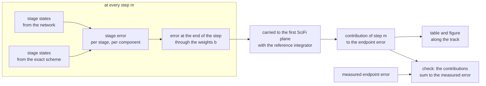

---

## 6. Experiments live outside the package

```
LHCb_Extrapolation_Project/
├── RK_Pinn_module/                   the package
└── experiments/
    └── <plain English name>/
        ├── README.md                 the question, the configurations, the findings
        ├── configurations/           one file per run
        ├── farm/                     job lists and submit files
        ├── analysis.ipynb            loads the standard report, computes nothing
        └── extra_analysis/           anything beyond the standard set
```

An experiment is a set of configuration files. A controlled comparison is two files that differ in one block.

```yaml
# experiments/<name>/configurations/64_steps_2_stages_cost_weighted.yaml
equation_of_motion: {system: lhcb, field_map: v8r1_up}
tracks:             {key: 12a8d35c3165}
steps:              {number_of_steps: 64, number_of_stages: 2}
network:            {width: 128, depth: 2}
loss:
  name: cost_weighted
  momentum_window_gev: [10.0, 50.0]
  roll_off: 0.6931
  floor: 0.05
  clamp: 5.0
training:           {states_per_round: 32000, restarts_per_round: 25,
                     iterations_per_restart: 200, stopping_rule: validation_plateau}
seed: 0
```

### The store

```
/data/bfys/gscriven/rkpinn_store/
├── tracks/<key>/              the data and its description
│   └── exact_scheme/<split>/  the exact scheme's states solved from these tracks,
│                              one file per number of steps and stages (built, phase 2)
├── runs/<key>/
│   ├── configuration.yaml     as resolved
│   ├── provenance.json        commit, package version, tracks key, field map hash
│   ├── restarts.csv, rounds.csv
│   ├── snapshots/<round>/     weights and scores, never overwritten
│   └── LOCK                   one writer at a time
└── manifest/
    ├── tracks.csv
    ├── exact_states.csv
    ├── runs.csv
    └── metrics.csv            recomputed from the snapshots
```

As built in phase 2: the project's track set has the key `12a8d35c3165`. A key is the first 12 characters of the sha256 hash of the content. The location of the store is an argument or the environment variable `RKPINN_STORE`, never a default in the code.

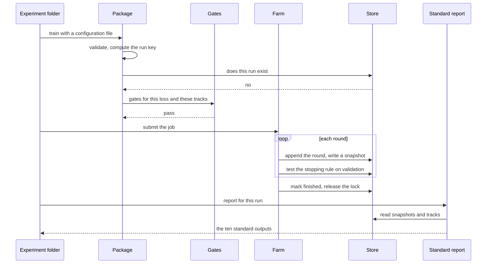

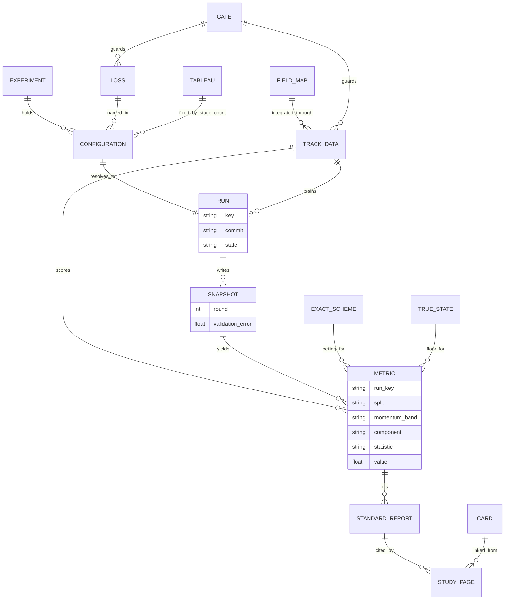

### The first experiment, for reference

It is not part of the package. It is listed so the package is built to serve it.

| Arm | Network | Loss |
|---|---|---|
| 1 | self-chained stage network | unweighted |
| 2 | self-chained stage network | pooled, equation 19 |
| 3 | self-chained stage network | cost-weighted, equation 20 |
| 4 | whole-crossing network | supervised endpoint |

It opens with two analyses that need no network: the RK6 reference against the Geant4-true state, and the exact Gauss–Legendre scheme at each stage count against RK6.

---

## 7. Literature that is added to, not rebuilt

| Layer | What it is | Changes when |
|---|---|---|
| **Card** | one page for one component: definition, full derivation, every symbol defined, its gates, its source file | the component changes |
| **Study page** | one page for one experiment: the question, the configurations, the standard report, the conclusion. It links to cards and does not restate them | a run finishes |
| **Assembled document** | a paper, thesis chapter or talk, built from cards and study pages | you decide to publish |

The cards of this package, and where their first text comes from:

| Card | First text from |
|---|---|
| The equation of motion and the field map | paper, the equation of motion in z |
| The Gauss–Legendre tableau | paper, collocation and the tableau |
| The exact collocation scheme and the ceiling | paper, exact collocation across the magnet |
| The sixth-order reference | paper, the sixth-order reference |
| The stage network, and collecting and summing the stages | **new** |
| The self chain | paper, chaining one network N times |
| The unweighted loss | **new**, short |
| The pooled loss | paper, equation 19 |
| The cost-weighted loss | paper, equation 20 and its derivation |
| The whole-crossing supervised network | **new** |
| The tracks on 257 planes | paper, the sample and the cut cascade |
| The Geant4-true state | the reference-against-truth write-up |
| Stage errors, held and carried | **new** |
| The standard evaluation | section 5 of this file |

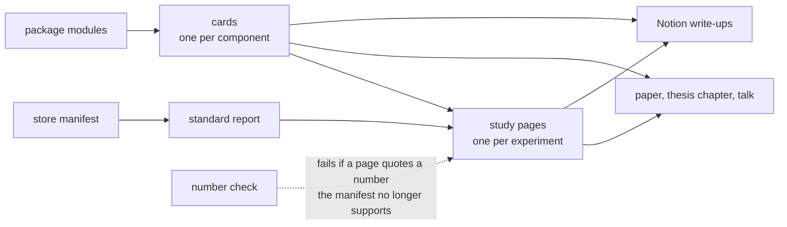

Notion stays the system of record. Each card and each study page is one Notion write-up, with the package version, the commit and the run keys in its Provenance. Trust stays Provisional until George verifies.

---

## 8. Rebuilding

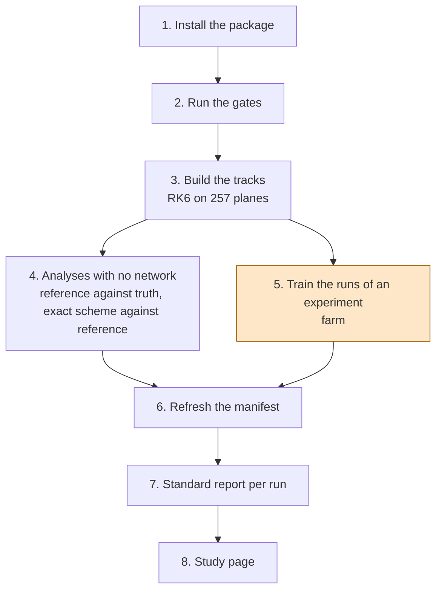

| Stage | Measured cost in the present code | Runs on |
|---|---|---|
| Build the tracks | 5.5 minutes on 16 workers | local |
| Reference against truth | about 20 seconds | local |
| Exact scheme table | 48 minutes, one core | local |
| Reference convergence | about 40 minutes, one thread | local |
| One self-chained network | 22 to 50 hours, by step count and stage count | farm |

Training is the only expensive stage. Snapshots are never overwritten, so training is repeated only when the training code itself changes.

---

## 9. Build order

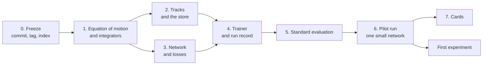

| Phase | Work | Done when |
|---|---|---|
| 0 | commit and push the working tree; tag it; INDEX.md in place | the tag is on the remote |
| 1 | port the equation of motion, field map, tableau, exact scheme, RK6 | every parity gate of section 4 for these modules passes |
| 2 | track builder and loader; store layout; keys; the exact states written once into the store, on one machine | the tracks rebuilt by the package match the stored file; the exact states in the store are reproduced to the last bit |
| 3 | the stage network, collect and sum, the self chain, the whole-crossing network, four losses | the five gates of section 3.3 pass for every loss |
| 4 | one round trainer taking the loss from the configuration; snapshots; locking | a run stops, resumes, and refuses a second writer |
| 5 | the ten standard outputs | run on an old run's stored states, they reproduce the paper's numbers |
| 6 | one small network end to end | see section 11 |
| 7 | the cards | each card builds and its numbers pass the number check |

---

## 10. Plain English names

The rule: a name says what the thing is, in full words, with its unit where it has one. No block letters, no abbreviations that need a glossary.

| Kind | Present name | Package name |
|---|---|---|
| Module | `irk.py` | `gauss_legendre_tableau.py` |
| Module | `reference.py` | `runge_kutta_sixth_order.py`, `lhcb.py` |
| Function | `rk6_rows` | `integrate_with_sixth_order` |
| Function | `carry` | `whole_track` |
| Function | `physics_loss` | `pooled_loss` |
| Function | `reconstruction_residuals` | `stage_residual` |
| Function | `plateaued_now` | `validation_has_plateaued` |
| Argument | `N`, `q`, `dz` | `number_of_steps`, `number_of_stages`, `step_length_mm` |
| Argument | `qop` | `charge_over_momentum` |
| Argument | `p_lo`, `p_hi` | `momentum_window_gev` |
| Constant | `D_ref`, `i_bar` | `reference_bend_mm`, `mean_field_integral` |
| Column | `pos_med_um` | `position_error_median_micrometres` |
| Column | `slope_med_mrad` | `slope_error_median` |
| Column | `val_z1_pos_med_um` | `validation_endpoint_error_median_micrometres` |
| File | `scale.json` | `configuration.yaml` |
| File | `history.csv` | `restarts.csv` |
| File | `record.json` | `scores.json` |
| Run folder | `N064_q02` | `64_steps_2_stages` plus the run key |
| Symbols in cards | $N$, $q$, $\Delta z$ | kept in equations, each defined where it first appears |

Mathematical symbols stay in equations. Code and file names use the words.

---

## 11. One risk, and three assumptions

### Rulings of 2026-09-28, after phase 1

George ruled on the risk and the assumptions below. They replace "assumptions I am building on".

| Question | Ruling | Consequence for the package |
|---|---|---|
| The three assumptions: which terms the loss sums over, what the unweighted baseline divides by, how the outputs are scaled | it depends on the experiment; keep the flexibility | none of the three is fixed in the code. Each is a setting in the configuration of a run, and the experiment states its value |
| The precision risk of emitting stages directly | as above; keep the flexibility | the output form is a setting in the configuration. The measurement and the pilot below stay |
| The root finder of the exact scheme | a study of it will be wanted at a later date | the solver is kept as ported. The study has its own to-do. Nothing is changed before it |
| The stored exact states that differ in the last digits | put the data in a single master store | the exact states are written once, on one machine, into `/data/bfys/gscriven/rkpinn_store`, in phase 2. The gate then compares with that store to the last bit |
| Write-ups | none without a discussion with George and a detailed plan | `CLAUDE.md` section 4 is amended |

What this does not change: a component that is not ruled in is not built (section 12.4, rule 5). Flexibility means the setting exists and the place is open. It does not mean every value of the setting is built now.

### The risk: precision of stages emitted directly

The correction to the straight line was introduced because it made short steps trainable. At 64 steps one step is 80.9 mm. Over that distance a track's position changes by millimetres, while the position itself spans hundreds of millimetres across the sample. A network that emits the stage state directly has to resolve a small change on top of a large value, to better than a micrometre.

This does not change the ruling. It is handled by measurement before any farm time is spent:

| Check | When | Pass |
|---|---|---|
| Size of stage minus input, relative to the size of the state, at each step length | phase 3, on the exact scheme's stages | recorded, so the required relative precision is known |
| Pilot run at 64 steps and 2 stages, pooled loss | phase 6 | single-step error within a factor of ten of the frozen self-chained network at the same size |
| If the pilot fails | before the first experiment | reported to George with the numbers; no workaround is added without a ruling |

### Assumptions I am building on

| # | Assumption | Why |
|---|---|---|
| 1 | The two equations are summed over the $q$ stages, and the mean divides by $4q$ | the endpoint term is zero identically once the endpoint is the sum of the stages |
| 2 | The unweighted baseline divides by nothing, so $x$ and $y$ in millimetres dominate the slopes | you asked for a baseline with none of the weightings. The pooled loss is itself a weighting |
| 3 | The network's outputs are scaled by fixed constants per component, measured once on the first round's states | some fixed scale is needed for the optimiser. A fixed constant is not a straight-line form |

Say so if any of the three is wrong. Each is one line to change.

---

## 12. Built to be extended

### 12.1 The seam

The experiments will change. The package is therefore built around one structure that every network fills and every loss and evaluation reads: the **predicted track**.

A predicted track holds, for each step it covers, the input state of that step, the stage states on that step's stage planes, and the end state of the step. It says nothing about how those states were produced.

| Kind of network | How it fills the predicted track |
|---|---|
| Self-chained stage network, built now | one step per application; applied N times for a whole track |
| Whole-crossing supervised network, built now | one step with no stages: the input and the end state |
| A network that learns the whole chain in one output, later | all N steps at once, from one application. Each step's input is the collected sum of the step before |
| A different network for each step, later | one step per network, in sequence |

Because the loss reads only the predicted track, equations 19 and 20 apply unchanged to every row of that table. The same holds for all ten standard evaluation outputs.

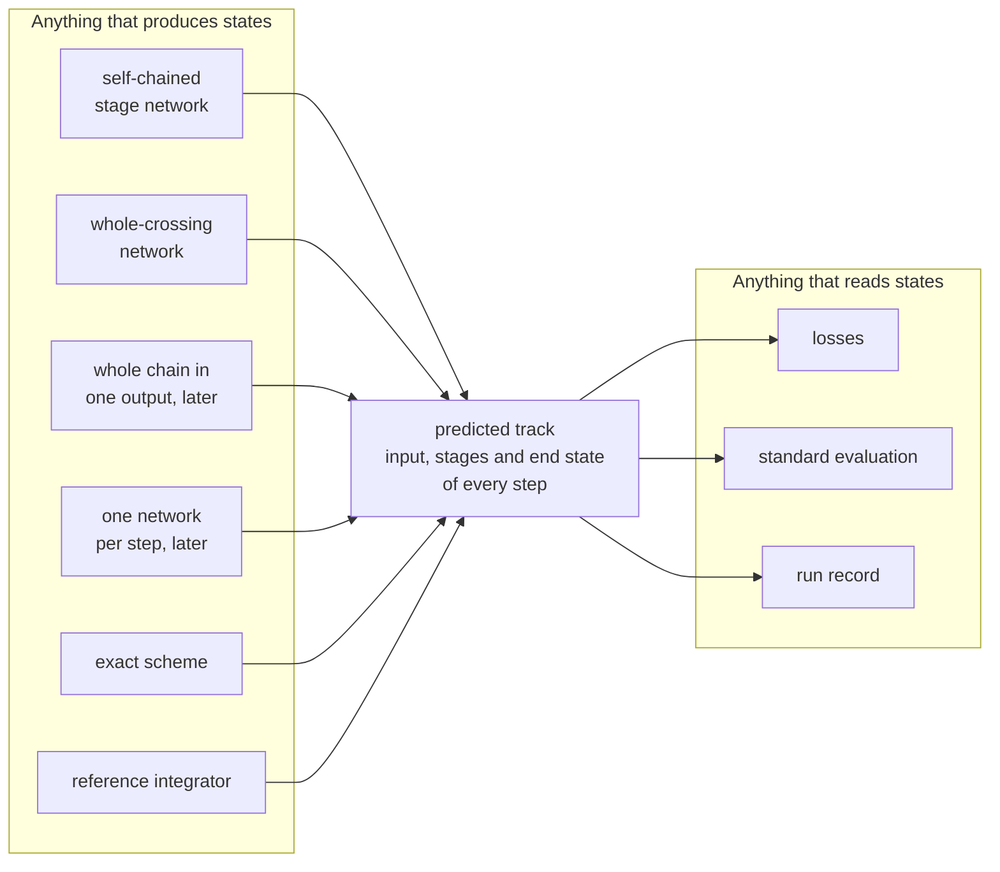

The exact scheme and the reference integrator fill the same structure. A comparator is then scored by the same code as a network.

### 12.2 What each future change costs

| Future change | What is added | What is not touched |
|---|---|---|
| A network that learns the whole chain in one output | one file in `networks/`, one training protocol that draws start states only | losses, targets, evaluation, run record |
| A new target | one file in `targets/` | networks, trainer, evaluation conventions |
| A new loss or a new weight | one file in `losses/` | networks, trainer, evaluation |
| A different network for each step | one file in `networks/`, one sequential training protocol | losses, evaluation |
| The straight-line correction again | one output form in `networks/output_forms.py` | losses, evaluation, trainer |
| A different collocation scheme | one tableau in `integrators/` | losses read the tableau they are given |
| A different physical system | one file in `equation_of_motion/` | everything else |
| A different stopping rule or optimiser | one file in `training/` | networks, losses |

### 12.3 The registry

A configuration file names components. The registry turns a name into the component. Adding a component is one file and one line of registration.

```yaml
network:            {kind: stage_network, output_form: direct_states, width: 128, depth: 2}
loss:               {name: cost_weighted, momentum_window_gev: [10.0, 50.0]}
target:             {name: no_target}
training_protocol:  {name: rounds_on_own_predictions}
```

### 12.4 Rules that keep it extensible

1. **A loss never imports a network.** It reads the predicted track.
2. **The evaluation never imports a network.** It reads the predicted track and the targets.
3. **The trainer never names a loss, a network or a target.** It takes them from the registry.
4. **No component reads a default it did not receive as an argument.** Every constant a run used is in its configuration.
5. **A component that is not ruled in is not built.** The design keeps the place open; the file is written when an experiment needs it.
6. **Every output form declares its answer for a zeroed network**, and a gate checks it.

Rule 5 is what keeps this from becoming heavier than the problem.

---

## 13. Description files and the workflow document

### 13.1 The rule

Every directory holds a `README.md` with the same four parts.

| Part | Content |
|---|---|
| What this directory is | two or three sentences |
| Contents | a table: every file and subdirectory, what it does, and whether it is built or planned |
| The contract | what a component in this directory must provide |
| How to add to it | the steps, ending with updating this file |

### 13.2 How it is kept true

A test, `tests/test_every_directory_is_described.py`, fails when:

- a directory has no `README.md`;
- a file or subdirectory exists that its `README.md` does not name;
- a file marked *built* does not exist.

The test runs with the gates. A change that adds a file without describing it does not pass.

### 13.3 The workflow document

[WORKFLOW.md](WORKFLOW.md) states how the package behaves and how work on it proceeds: the life of a run, what is refused, how a component is added, how behaviour is changed, and what is recorded where.

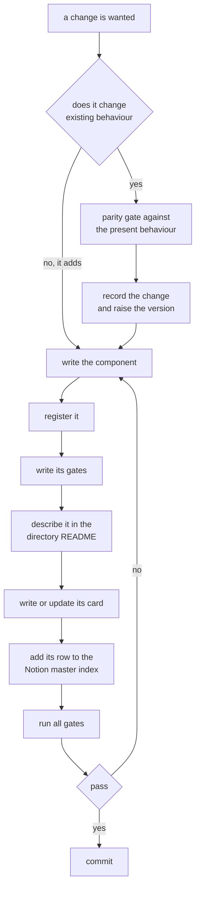

---

## 14. The Notion project page

The project page becomes the place that is always open: a master index and workflow guide, not a write-up. It applies to work from now on. Earlier write-ups are left as they are.

| Section of the page | Content | Kept current by |
|---|---|---|
| Status | where the project is, and what is waiting on George | each session's end |
| How we work | the workflow, condensed from WORKFLOW.md | a change to WORKFLOW.md |
| Master index | one entry per component, grouped as methods, networks, losses, targets, data, evaluation. Each entry holds its theory, its source file and its gates | adding or changing a component |
| Experiments | a table, one row per experiment, each pointing to its write-up | starting and finishing an experiment |
| Existing content | the simulation guide, meetings, to-dos, literature, write-ups | unchanged |

The experiments table:

| Column | Content |
|---|---|
| Experiment | its plain English name |
| Question | one sentence |
| Status | planned, running, analysed, written up |
| Network, loss, target | the names from the configuration |
| Steps and stages | the cells that were run |
| Run keys | the keys in the store |
| Folder | the experiment's folder in the repository |
| Write-up | a relation to the write-up of record |
| Started, finished | dates |

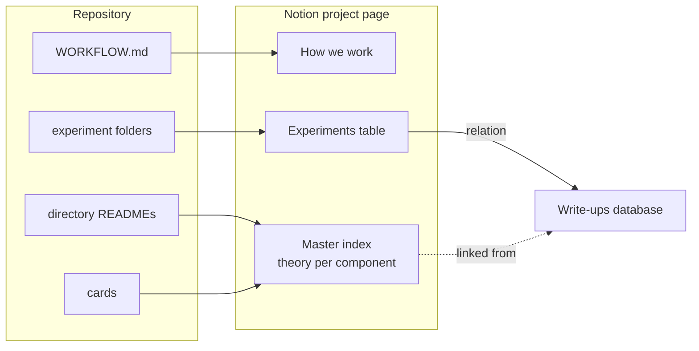

The copy the page is updated from is in [docs/notion/](docs/notion/). The page and the experiments table were published on 2026-09-28; the links are in [docs/notion/README.md](docs/notion/README.md).
