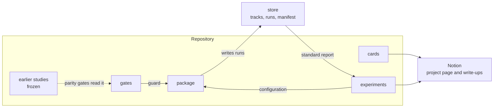
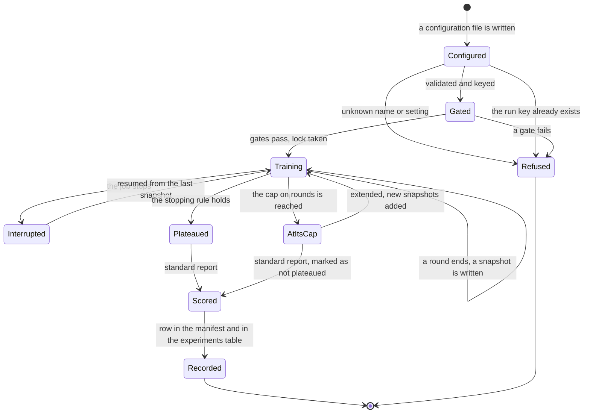
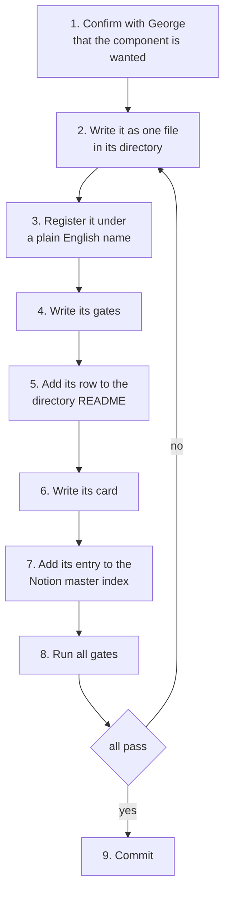
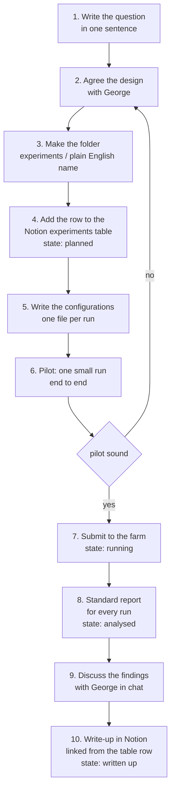

# Workflow: how the package behaves, and how work on it proceeds

**Last updated:** 2026-09-28 · **Applies to:** everything under `RK_Pinn_module/` and every experiment that uses it

This document is the rule book. The plan is in [PACKAGE_PLAN.md](PACKAGE_PLAN.md). The library of what exists is in [INDEX.md](INDEX.md).

If this document and the code disagree, that is a defect. Fix one of them in the same change.

## Contents

1. [What the package is for](#1-what-the-package-is-for)
2. [What goes where](#2-what-goes-where)
3. [How the package behaves](#3-how-the-package-behaves)
4. [The life of a run](#4-the-life-of-a-run)
5. [The description rule](#5-the-description-rule)
6. [Adding a component](#6-adding-a-component)
7. [Changing existing behaviour](#7-changing-existing-behaviour)
8. [Running an experiment](#8-running-an-experiment)
9. [Writing it down](#9-writing-it-down)
10. [Names](#10-names)

---

## 1. What the package is for

The package trains Runge–Kutta physics-informed networks that are chained to themselves to give a full track, and scores them in one standard way.

It is built so that the things most likely to change can change alone: the network, the loss, the target, the training protocol.

---

## 2. What goes where

| Thing | Where | In git |
|---|---|---|
| Code that any experiment would use | `RK_Pinn_module/src/rkpinn/` | yes |
| Gates | `RK_Pinn_module/tests/` | yes |
| Cards, one per component | `RK_Pinn_module/docs/cards/` | yes |
| An experiment: its configurations, farm files, notebook, extra analysis | `LHCb_Extrapolation_Project/experiments/<plain English name>/` | yes |
| Track sets, run snapshots, the manifest | `/data/bfys/gscriven/rkpinn_store/` | no |
| The master index, the workflow guide, the experiments table, write-ups | Notion, the project page | the draft is in `docs/notion/` |
| Everything built before the package | its present folder, unchanged | yes |

---

## 3. How the package behaves

### It always

| Behaviour | Why |
|---|---|
| Takes every setting of a run from one configuration file | a run can be repeated from that file alone |
| Computes a run's key from its resolved configuration and its tracks key | the same settings cannot exist under two names |
| Records the commit, the package version and the field map's hash with every run | every number can be traced |
| Writes a snapshot after every round and never overwrites one | a table always matches the files it cites |
| Holds a lock while a job writes to a run | two jobs cannot write to one run |
| Refers to tracks by key | a run can be moved or rebuilt elsewhere |
| Runs the gates of the chosen loss, network and tracks before training | a mistake costs seconds, not farm hours |
| Judges convergence on the validation error | the loss can be flat while the error is still falling |
| Works in double precision | the residuals are near 1e-9 |
| Reports positions in micrometres and slopes as dimensionless numbers | one convention, defined once |

### It refuses

| Refusal | What to do instead |
|---|---|
| To train from a working tree with uncommitted changes | commit, or pass the option that records the run as untraceable |
| To start a run whose key already exists | extend that run, or change the configuration |
| To write to a run that is locked | wait, or clear the lock after checking no job holds it |
| A configuration with a name the registry does not know | register the component first |
| A configuration with a setting it does not recognise | remove it, or add it to the schema |
| To use the test split for stopping | use validation |

### It never

- inserts into the import path, or loads a module by its file location;
- reads a constant from a module default when the run has its own value;
- lets a loss or the evaluation import a network;
- stores an absolute path in a run.

---

## 4. The life of a run

A run that reached its cap without a plateau is reported as such in every table that uses it.

---

## 5. The description rule

**Every directory holds a `README.md` that explains everything in it. It is updated in the same change that adds or alters anything in the directory.**

Each `README.md` has four parts, in this order.

| Part | Content |
|---|---|
| What this directory is | two or three sentences |
| Contents | a table with one row per file and subdirectory: its name, what it does, and its state, which is `built` or `planned` |
| The contract | what a component in this directory must provide |
| How to add to it | the steps, ending with updating the file |

The date at the top is changed with every edit.

The rule is enforced by `tests/test_every_directory_is_described.py`. It fails when:

- a directory has no `README.md`;
- something exists that the `README.md` does not name;
- something marked `built` does not exist;
- something marked `planned` exists.

The rule applies to experiment folders too. The test covers `RK_Pinn_module/`; each experiment folder follows the same format by hand until the test is extended to it.

---

## 6. Adding a component

A component is a network, an output form, a loss, a target, an integrator, an equation of motion, a training protocol or a stopping rule.

| Step | Done when |
|---|---|
| 1 | the structural choices are stated and George has ruled on each. An adaptation of a paper is never described as what the paper does |
| 2 | the file meets the contract in its directory's README |
| 3 | a configuration file can name it |
| 4 | the gates state what they prove and pass |
| 5 | the description test passes |
| 6 | the card derives the component in full, with every symbol defined |
| 7 | the project page lists it with its theory, source file and gates |
| 8 | every gate of the package passes, not only the new ones |
| 9 | the commit message says what was added |

What must not be needed: a change to the trainer, to another loss, or to the evaluation. If adding a component requires one of those, the contract is wrong. Stop and raise it.

---

## 7. Changing existing behaviour

Adding is cheap. Changing is not, because earlier runs were made with the earlier behaviour.

1. State what changes and which runs it affects.
2. Write a gate that holds the present behaviour, and see it pass.
3. Make the change.
4. Either the gate still passes, or the change is recorded: what differs, by how much, and from which version.
5. Raise the package version.
6. Update the directory README, the card and the Notion entry.
7. Runs made before the change keep their recorded version. They are not re-scored silently.

---

## 8. Running an experiment

| Rule | |
|---|---|
| A controlled comparison changes one block of the configuration | the difference between two runs can be printed |
| The criteria for success are written before the runs are submitted | in the experiment's README |
| The standard report is produced for every run | extra analysis is added beside it, not instead of it |
| Findings are discussed before a write-up is made | no write-up is created unreviewed |
| A write-up is Provisional until George verifies it | only George sets Verified |

---

## 9. Writing it down

| What | Where | When |
|---|---|---|
| What a file does | its directory's README | in the same change |
| The theory of a component | its card, mirrored in the Notion master index | when the component is added or changed |
| What an experiment asked and found | its README, then its Notion write-up | as it proceeds |
| That an experiment exists, and its state | the Notion experiments table | when it starts and at every change of state |
| Commands, intermediate numbers, dead ends | the body of the Notion to-do | as they happen |
| How the package behaves | this file | when the behaviour changes |

Theory is written once, in the card. A study page links to cards and does not restate them.

---

## 10. Names

Everything is named in plain English: what the thing is, in full words, with its unit where it has one.

| Kind | Rule | Example |
|---|---|---|
| Module | what it holds | `gauss_legendre_tableau.py` |
| Function | what it does | `whole_track` |
| Argument | the quantity, with its unit | `step_length_mm`, `momentum_window_gev` |
| Column | the quantity, the statistic, the unit | `position_error_median_micrometres` |
| Run folder | what the run is | `64_steps_2_stages` and its key |
| Experiment folder | the question it asks | never a block letter |
| Figure and table | the network by its steps, stages and step length | never a block letter |
| Symbols | kept in equations | each defined where it first appears |
